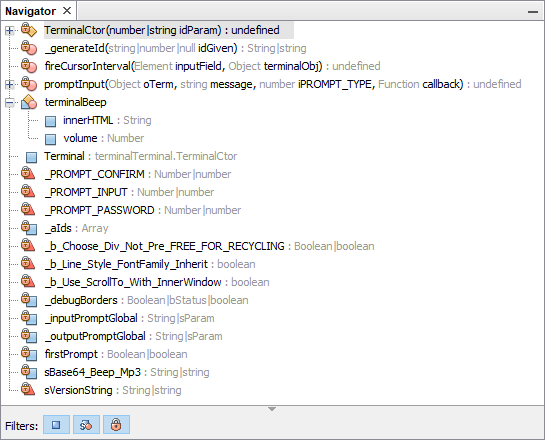
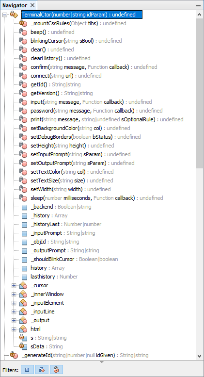
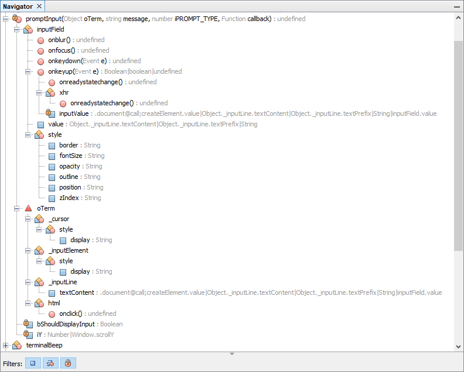
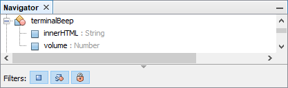

Other pages : &nbsp;
 • [ReadMe](./../README.md) &nbsp;
 • [API Doc](./api-doc.md) &nbsp;
 • Dev Doc &nbsp;
 • [Notes](./notes.md) &nbsp;
 • [Issues](./issues.md) &nbsp;
 • [Changes](./changes.md) &nbsp;
 • [Credits](./credits.md)

# Developers Documentation

Subsections : &nbsp;
 • [Overview](#id20210513o1121)
 • [Complete](#id20210513o1125)
 • [TerminalCtor](#id20210513o1131)
 • [promptInput](#id20210513o1135)
 • [terminalBeep](#id20210513o1141)
 • [Legend](#id20210513o1145)

## Overview

This are just NetBeans Navigator screenshots, to provide an overview,
 what's in there, including an educated interpretation, expressed by the icons.

### Complete program collapsed 

### Function `TerminalCtor` expanded 

### Function `promptInput` expanded 

Note the funny types of the `inputValue` and `textContent` variables. Have they
 really to be so complex? Can this perhaps be simplified?

### Variable `terminalBeep` expanded 

This little panel can help to comprehend, how the NetBeans Navigator works,
 because it is so small, and one can easily trace in the code, what's there.
 Why does it show `innerHTML`, but not `outerHTML`? It just collects the
 identifiers it can find, and assigns them an icon.

### Legend 

It is not soo clear, what the icons mean exactly. The legends
 are rare, here are some :

-  Oracle help chapter 6.3.1 'Browsing Java Files', subsection
 [Icon - Description](https://docs.oracle.com/cd/E50453_01/doc.80/e50452/work_java_code.htm#r1c1-t5).

- Oracle page 'Working with NetBeans IDE' subsection
 [Table 2-16 Icons in the Code Completion Window](https://docs.oracle.com/netbeans/nb81/netbeans/develop/working_nbeans.htm#sthref75)

-  Apache Netbeans page 'Code Assistance in the NetBeans IDE Java
 Editor: A Reference Guide', which is about C++ :
 [Appendix A: Icons in the Code Completion Window](https://netbeans.apache.org/kb/docs/java/editor-codereference.html#_appendix_a_icons_in_the_code_completion_window).

This are all not a really pervasive legends.

The icons are to be taken with a grain of salt anyway. The icons are made for
 OOP languages. JavaScript is not really object oriented, though this is often
 stated. The OO features are not programmed by means of keywords, instead are
 built at own risk with the help of design patterns. The ES5 `class` keyword
 does not change this situation, it is only syntactic sugar on the surface.

Howsoever. Even if the icons are not clear in every detail, graphics
 like above I find a great help to comprehend a program's concept.

Todo: Make a icon legend. 20210513°1211

&nbsp;

---

File 20210513°1111 ܀Ω
